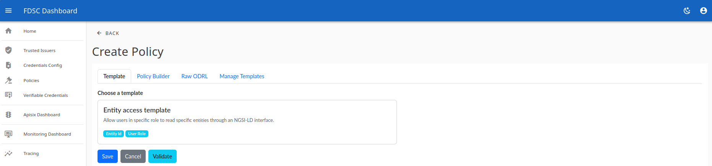
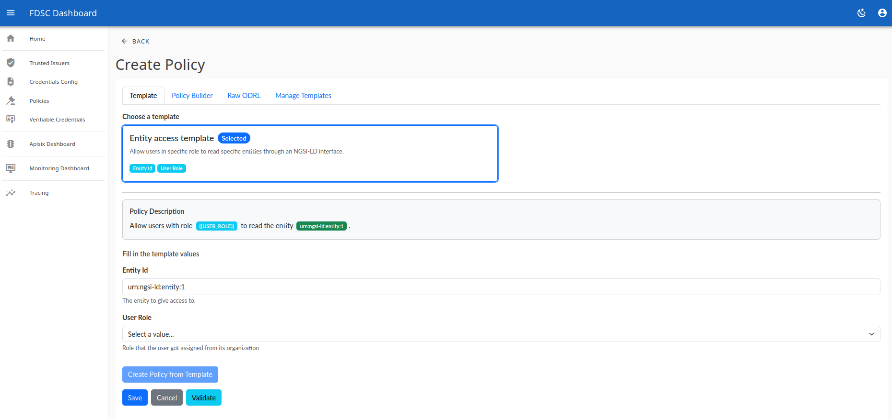
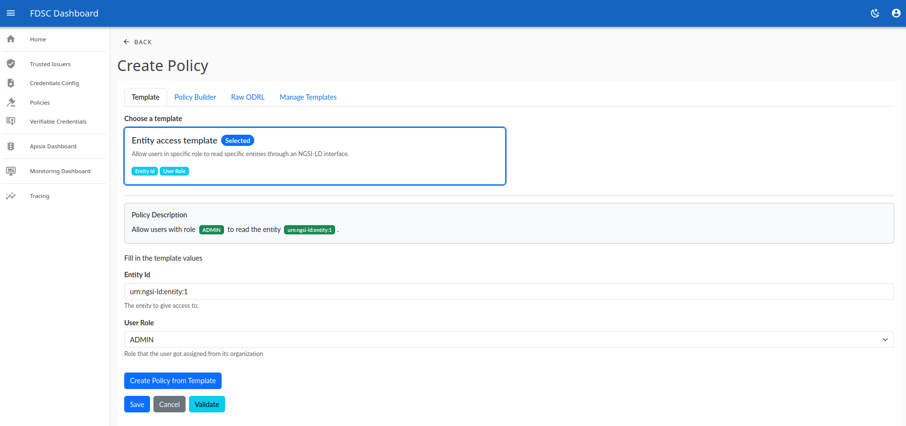
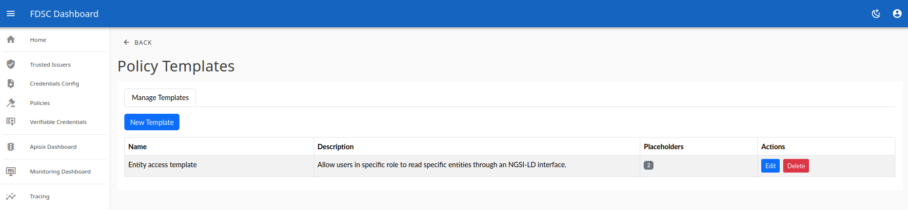
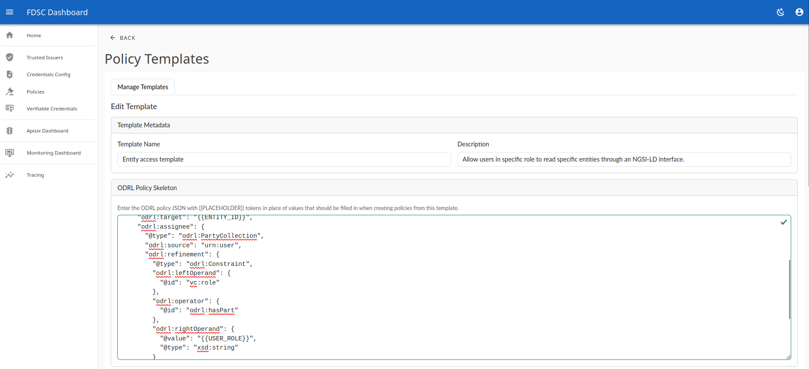
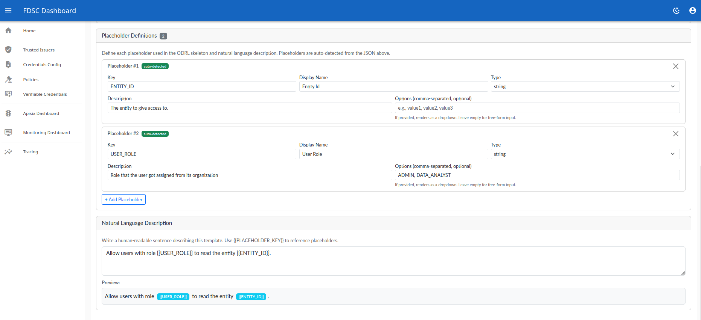

# Policy Editor — User Guide

This guide explains how to create access policies and manage policy
**templates** using the ODRL Policy Editor. It is written for end users — no
knowledge of ODRL or JSON is required to follow the everyday workflow.

The editor lets you create a policy in one of three ways:

- **From a template** — fill in a few labelled fields (the easiest way, and the
  focus of this guide).
- **With the Policy Builder** — assemble a policy visually from dropdowns.
- **As raw ODRL** — paste or edit the policy JSON directly.

Whichever you choose, you can **Validate** the policy against a test request
before saving it.

---

## Contents

- [Key terms](#key-terms)
- [Creating a policy from a template](#creating-a-policy-from-a-template)
  - [1. Open the Create Policy screen](#1-open-the-create-policy-screen)
  - [2. Choose a template](#2-choose-a-template)
  - [3. Fill in the values](#3-fill-in-the-values)
  - [4. Create the policy](#4-create-the-policy)
- [Managing templates](#managing-templates)
  - [The template list](#the-template-list)
  - [Creating or editing a template](#creating-or-editing-a-template)
- [Tips](#tips)

---

## Key terms

| Term | What it means |
|------|---------------|
| **Policy** | A rule that decides who is allowed to do what — for example, "allow users with role *ADMIN* to read entity *urn:ngsi-ld:entity:1*". |
| **Template** | A reusable policy with blanks left to fill in. Instead of writing a policy from scratch, you pick a template and complete a few fields. |
| **Placeholder** | A named blank inside a template, written as `{{PLACEHOLDER}}` (for example `{{USER_ROLE}}`). When you create a policy, each placeholder becomes an input field. |

---

## Creating a policy from a template

This is the quickest way to create a valid policy.

### 1. Open the Create Policy screen

Open **Create Policy**. Across the top you will see the **Template**, **Policy
Builder**, and **Raw ODRL** tabs; the **Template** tab is selected by default
when templates are available. When the editor is embedded in a host application
(via the web component), an extra **Manage Templates** tab is also shown — see
[Managing templates](#managing-templates). In the standalone app, templates are
managed on a separate **Templates** page instead.

Each template is shown as a card with its name, a short description, and small
badges for the values you will need to provide (here, **Entity Id** and **User
Role**).

### 2. Choose a template

Click the template card to select it. The selected card is highlighted with a
blue border and a **Selected** badge, and the fields to fill in appear below.

### 3. Fill in the values

Under **Fill in the template values**, complete each field. The field type
depends on how the template was defined:

- A **free-text field** (like *Entity Id*) accepts any value you type.
- A **dropdown** (like *User Role*) lets you pick from a fixed list of allowed
  values.

The help text under each field explains what it is for.

As you type, the **Policy Description** box at the top updates to show, in plain
language, exactly what the policy will do. Values you have not filled in yet are
shown as highlighted placeholders, so it is easy to see what is still missing:

Once every value is provided, the description reads as a complete sentence and
the **Create Policy from Template** button becomes active:

### 4. Create the policy

- Click **Create Policy from Template** to generate and store the policy from
  your filled-in values.
- Optionally click **Validate** first to test the policy against a sample
  request before creating it.
- **Save** stores the current policy; **Cancel** discards your changes.

That's it — you have created a policy without writing any ODRL by hand.

---

## Managing templates

Templates are managed from the **Manage Templates** tab (also available as a
dedicated **Policy Templates** screen). This is where administrators define the
templates that everyone else fills in.

### The template list

The list shows every existing template with its name, description, and the
number of placeholders it contains. From here you can:

- **New Template** — create a template from scratch.
- **Edit** — change an existing template.
- **Delete** — remove a template you no longer need.

### Creating or editing a template

The template editor has four sections.

**1. Template Metadata** — the **Template Name** and **Description** shown to
users when they pick the template.

**2. ODRL Policy Skeleton** — the policy itself, written as ODRL JSON, with a
`{{PLACEHOLDER}}` token wherever a value should be filled in later. In the
example below, `{{ENTITY_ID}}` marks the target entity and `{{USER_ROLE}}` marks
the required role. A green check appears when the JSON is valid.

**3. Placeholder Definitions** — placeholders are **auto-detected** from the
skeleton, so each one you type appears here automatically. For every placeholder
you can set:

- **Key** — the token name used in the skeleton (e.g. `USER_ROLE`).
- **Display Name** — the label shown to users (e.g. *User Role*).
- **Type** — the kind of value (string, number, boolean, or date).
- **Description** — help text shown under the field.
- **Options** — an optional comma-separated list (e.g. `ADMIN, DATA_ANALYST`).
  When options are provided, the field is shown to users as a **dropdown**;
  otherwise it is a free-text input.

**4. Natural Language Description** — a plain-language sentence describing the
template, using `{{PLACEHOLDER_KEY}}` to reference the placeholders. The
**Preview** underneath highlights each placeholder so you can check the wording.
This sentence is what users see (with their values filled in) as the *Policy
Description* when creating a policy.

Click **Save** to store the template. It then becomes available for everyone on
the Create Policy screen.

---

## Tips

- **Let the description guide you.** When creating a policy, the live *Policy
  Description* tells you in plain words what the policy will do — if it reads
  correctly, your values are right.
- **Highlighted placeholders mean "not filled in yet."** The *Create Policy from
  Template* button stays disabled until every value is provided.
- **Use Options to prevent mistakes.** Defining a placeholder's *Options* turns
  its field into a dropdown, so users can only choose valid values.
- **Validate before you save.** The **Validate** button lets you check a policy
  against a sample request, so you can confirm it behaves as expected before it
  goes live.
